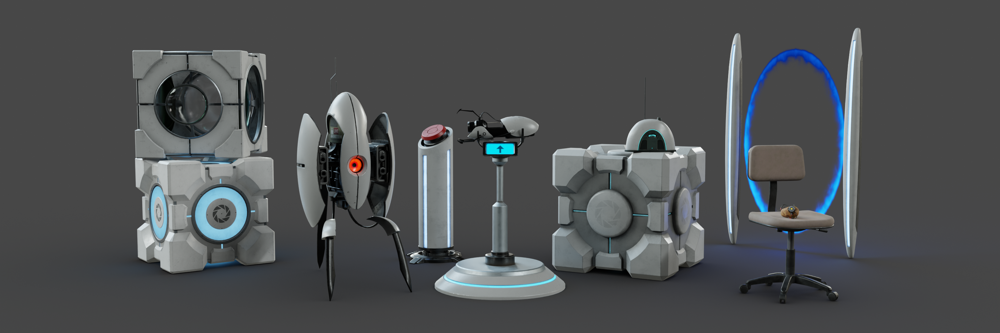
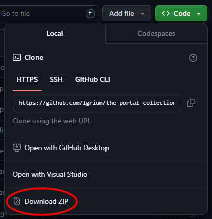
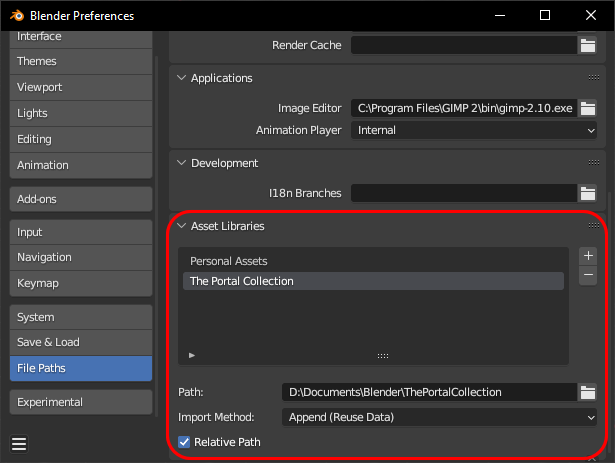

# The Portal Collection

>  A subset of the models in this collection

## About

Over the past few years, I've remade and remastered a set of models from the Portal games in Blender. Seeing as I've amassed quite a few at this point, largely due to my work at the Quanta Collective, I've decided to assemble them into an easy-to-use asset pack for all your fan-animation needs.

The models are split into the following categories:

- **Retexture**: These models are mostly ripped straight from the game, cleaned up a bit, and then re-textured with modern PBR textures.

- **Remaster**: Some of the models are a little too dated for a simple retexture. Remastered models still contain elements from the original game assets, however there is significantly more original work added to them. Although retextures often contain updated geometry, the distinction comes from the fact that remasters have new UV maps.

- **Remake** These models have, for one reason or another, been completely remade from scratch. The prime example of this is the Portal Gun, which was worked on for over a year to bring the highest fidelity possible.

Most of these models are also available standalone on [Sketchfab](https://sketchfab.com/Sam54123/collections/the-portal-collection-5d6c5ab6c268450e9768a94c4b052197).

> ***Disclaimer:*** *These are fan models, and are in no way affiliated with Valve. While I take no issue with them being used commercially (given antiquate credit), I take no responsibility for any legal action incurred from Valve.*

## Unit Scale

Care has been taken to keep these models dimensionally accurate and true to the original artistic intent. Each model has been ported and/or remade at a scale of 1 hammer unit = 1 inch (.0254 meters). It is also common to represent Source Engine models at a scale of 1 hammer unit = 0.01905 meters. If this is desired, simply scale each model by .075.

## Installation

To download the collection, click "*Code > Download Zip*", and extract the zip contents to somewhere on your computer. 

Alternatively, you can clone this repository with a Git client to ease the installation of future updates.

Then, simply add the installed folder as an asset library in Blender.

Each file in the collection is self-contained, with all its textures packed in. This means that you can remove the blend from the collection folder and it will still work.
